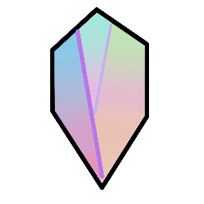

# Dcey-SMP-Docs-V6

  
The 6th Version of the Dcey SMP Docs

# Building

This doc is built with Docusaurus. The docs files are under `./docs`. If you wish to use a live server in order to check, make sure you have Node, npm or yarn installed.

- npx: `cd docs && npx docusaurus start`
- yarn: `cd docs && yarn run start`

To build, use `npm run build` or `yarn run build`.
