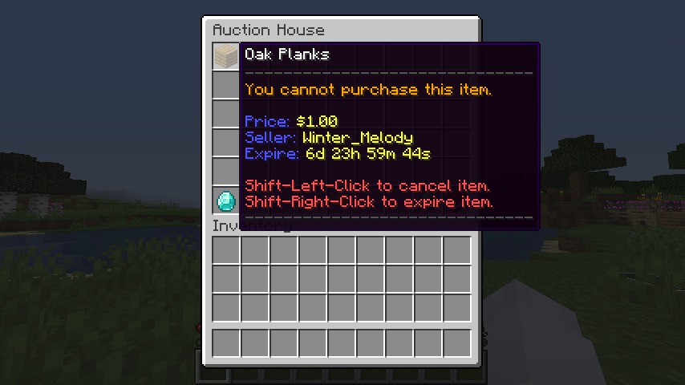

There are 2 ways to make a player shop: using the auction house, or a chest-based one.

## QuickShop

The QuickShop plugin allows you to setup shops that in the form of chests. These have to be placed down somewhere in the world; preferably in a shop or building.

### Sell Chests

In order to set one up, you have to do the `/qs create` cmd (you have to be looking at a chest in order to do this).

After that, it will create a shop, where you can add the amount of stuff that you are selling into the chest. You can add more if you like. And that's all it. Note that you cannot make a sell and a buy chest in the same chest. You have to do them seperately. In order to refill, just add in the items into the chest if you are the owner or staff of one.

### Buy Chests

In order to make a buy chest, you first have to make a sell chest. Then, just type in `/qs buy` while looking at the chest, and you have turned your sell chest into a buy chest.

### Additional Notes

You can right-click on the sign to show a control panel for your shop. You can change it to a sell or buy shop here if you prefer to.

## Auction House

The Auction House plugin allows you to bid and sell items. This is just like an auction house, where people would go and buy the item that bids the highest

### Selling Items

To start, first do /ah sell and input the price that you want to sell for. Make sure to hold the item that you want to sell for in your hand. And you can do /ah to look at the item sold.

### Canceling Items

In order to cancel your items (basically to take it back), all you have to do is to shift-let-click on the item within the auction house gui. If you want to remove all auctions, use the `/ah cancel` and `/ah return` cmd to cancel and return the items back.

