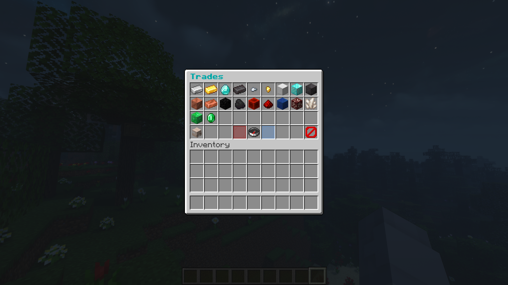

# Guide on the Player-based Economy

Some of you might be confused on how to start using the economy that is built-in to the server. Well, here's a guide to help you get started.

## Obtaining the Virtual Currency

Within this server, there are multiple ways to get the money needed to buy items at the player shops.

### Server Shop Trades

You will need to start mining first. if you have mined out the resources needed, you can do the `/shop` cmd in-game,  and you will see a server shop gui. Click on the the "Trades" shop, and look at what can be traded in for the virtual currency.

Right click on the items, and depending if you have them on hand or in your inventory, it will sell these items and give you the virtual currency. It's basically like those currency convertors at the airport you see when going to a different country. And now you have basically converted your items into the currency.

### Quests

This server also features a quests system, where you can start quests in order to gain money. Currently as of writing this (7/13/2021), there are quests available for killing mobs, in which you get money out of it. More are planned to be added soon.

### Jobs

The newly introduced Jobs system adds in jobs for another method to earn money. By joining a job (`/job join [insert job name here]`), you are able to recieve money at a steady rate. Some of them have quests, and can earn more money that way. Boosters may be added in as a way to get people to join these jobs and earn even more money. Currently, it uses the default jobs suppiled by [Jobs Reborn](https://www.spigotmc.org/resources/jobs-reborn.4216/), and custom ones are planned to be added.

### Mob Drops

Mobs will have a 25% chance to drop some money. This might be a good way to earn money quick, since all mobs are affected by this. Some mobs drop more than others, so go out there and kill as much mobs as you can.

### Players

There is a 15% chance that a player will drop some money during death

## Using the Player Shops

Once you have the currency, you can use them to trade at the player shops. These player shops are run by the players themselves, and can provide with items that they would be selling. It could be supplies, redstone, food, etc. If you want to create a player shop, refer to the [Guide on the Player Shops](guide-on-the-player-shops.md) page

Note: This is no way a pay-2-win server. I absolutely despise p2w servers, and will find ways to use exploits and dupes to ruin the server.
